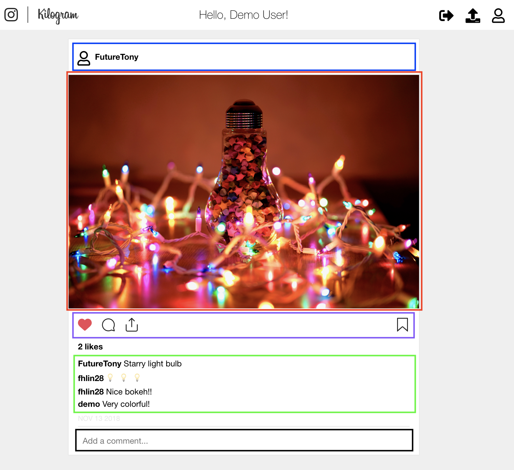
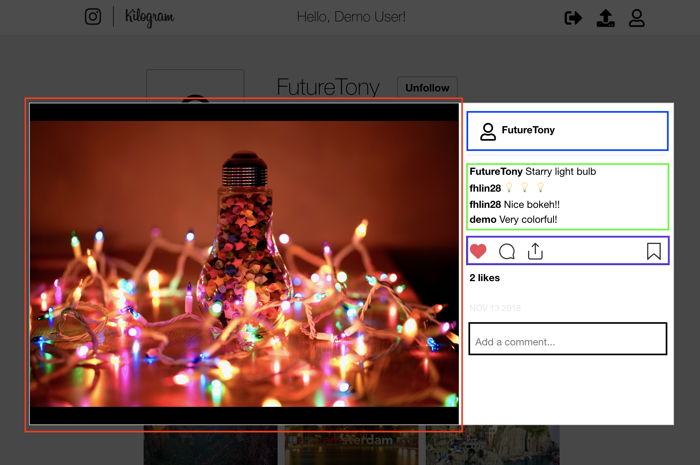

# Kilogram
___
[Live Link](https://kil0gram.herokuapp.com/#/signin)

[Kilogram](https://kil0gram.herokuapp.com/#/signin) is a full stack, single page applicatin clone of Instagram. Users of Kilogram will be able to interact with many of the following core features.


## Features
  * Sign up/in with username and password or demo account
  * Share images by uploading to AWS S3
  * Follow users
  * View scroll feed of followed user's postings
  * Like a post
  * Comment on a post
___
## Technologies Used
  * Ruby on Rails (RESTful APIs)
  * PostgreSQL (relational SQL database)
  * React.js
  * Redux
  * Bcrypt (user authentication)
  * AWS S3 (image uploads)
  * HTML
  * CSS
  * Heroku
___
## Feature Challenges/Highlights
### Liking and Unliking a Post

Liking a post seems like a trivial matter but it is one of the core way to express on Kilogram. The incorrect way to build `likes` is to simply nest a likes counter in the associated posts record. This would not prevent users from liking a post multiple times, thus an indicator of some sort is needed, and the `likes` table is migrated.

```ruby
create_table "likes", force: :cascade do |t|
  t.integer "post_id", null: false
  t.integer "user_id", null: false
  t.index ["post_id", "user_id"], name: "index_likes_on_post_id_and_user_id", unique: true
  t.index ["user_id"], name: "index_likes_on_user_id"
end
```

This method brings up a performance issue in the frontend. Given this normalized Redux state, how can you tell if a user liked a post (quickly)? The naive approach would be to traverse all the `likes` and check each one for the matching post and user. This is tedious and time consuming.

I devised a denormalized approach for the Redux store and nested the likes data (called likers) under each post as shown below:

    posts: {
      1: {
        id: 1,
        authorId: 1,
        imgUrl: 'www.s3.aws.com/1234567890',
        likers: {
          1: false,
          2: true,
          4: true
        },
        createdAt: 201810040042
      }

This data structure can deteremine if the current user has liked a particular post in O(1) time and conditionally shade in the heart icon red if the `likers[current_user_id]` is true. Conversely, disliking a post simply modifies the boolean to false. Lastly, counting the number of likers for an associated post is done so by tallying up the true values. This efficently solved the issue of a user liking a post multiple times.

On the topic of unliking a post, I created a custom BE API endpoint to handle unliking with this denormalized data structure.

```ruby
delete 'api/likes/:post_id', to: 'api/likes#destroy', defaults: {format: :json}
```

Instead of looking up the like record to delete by the `like` id. The FE will send a delete request with the associated `post_id`. In combination with user auth session, the BE will determine the current user and and find the associated like record by requested `post_id` parameter.
___
### Reusable Modular React Components

In Kilogram, there were many similar components used in the post index and post show page. I have highlighted with corresponding color below.





To take full advantage of React, I simplified my codebase by reusing these components in both places.

```jsx
return (
  <div className='post-index-item'>
    <PostHeader
      currentPost={currentPost}
      author={author}
    />

    <PostImage
      currentUser={currentUser}
      currentPost={currentPost}
      postLike={postLike}

      openModal={this.props.openModal}
      closeModal={this.props.closeModal}
    />

    <div className='post-index-footer'>
      <PostActionBar
        currentUser={currentUser}
        currentPost={currentPost}
        postLike={postLike}
        deleteLike={deleteLike}
      />

      <CommentIndex
        currentPost={currentPost}
        author={author}
        users={users}
        comments={comments}
      />

      <div>
        <p className='post-timestamp'>
          {Date(currentPost.createdAt).slice(4, 15)}
        </p>
      </div>

      <CommentForm
        currentPost={currentPost}
        postComment={postComment}
      />
    </div>
  </div>
);
```
___
## Features in the Pipeline:
  * Infinite scrolling
  * Like animation (pop up heart)
  * User avatar pictures
  * Notifications for follows, likes, comments
  * Nested recursive comments

